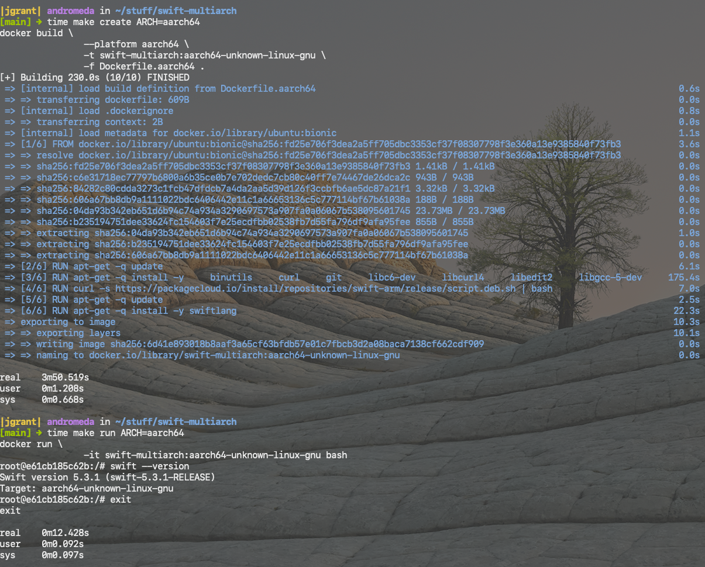

# swift-multiarch

  <table style="border-collapse: collapse; border: none;">
    <tr>
      <td>
        
      </td>
      <td>
        
      </td>
      <td>
        
      </td>
    </tr>
  </table>

  
Multi-platform architecture toolchains for Apple's Swift Language

## Why ?
Although official Docker images exist for Swift they are limited to x86_64 platforms.
This enables a simple way of supporting other platforms too such as aarch64, armv8 etc.

## Usage

